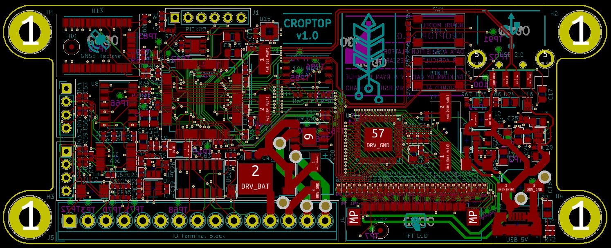
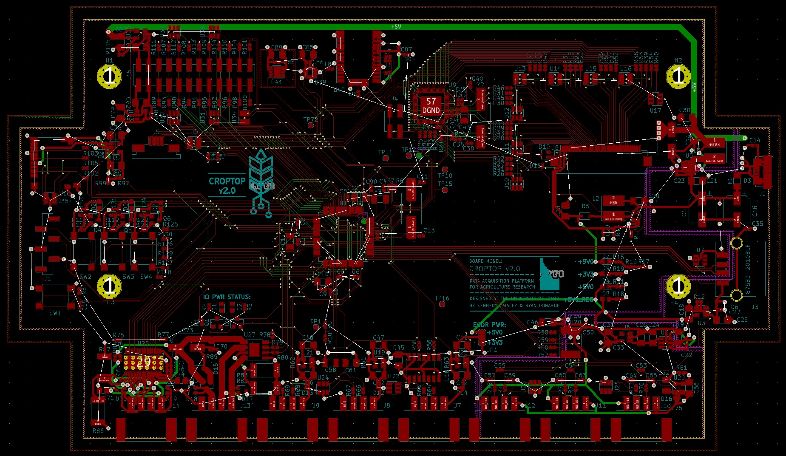
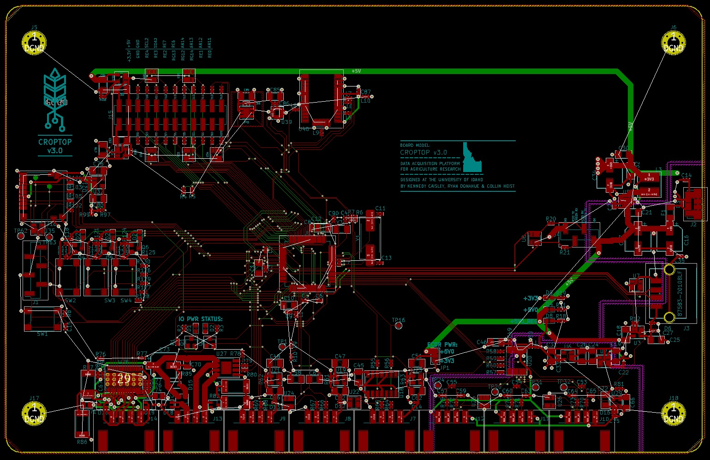

# CropTop
## Development
CropTop is a small-form data acquisition platform initially developed by Kennedy Caisley and Ryan Donahue, two undergraduate electrical engineering students at the University of Idaho. It is designed to support the cereal grain crop strength research being conducted by [Dr. Daniel Roberston](https://www.uidaho.edu/engr/departments/me/our-people/faculty/daniel-robertson) in the UI Department of Mechanical Engineering.

The current iteration of the project is being developed by [Collin Heist](https://github.com/CollinHeist), an undergraduate Electrical Engineering student at University of Idaho.

## What can CropTop do? 
Croptop is based around a 32 bit PIC32MX795F512L microcontroller and includes the following peripherals onboard:

* 12 bit temperature/humidity sensor
* 3-axis accelerometer
* ΔΣ 24 bit 1kSPS ADC
* GNSS receiver
* USB 2.0 OTG interface
* 5A DC motor controller
* Resistive touch controller
* Rotary encoder interface
* Linear encoder interface
* 1GB NAND flash
* User programmable push buttons
* User programmable LEDs
* 14 additional GPIO

The current screen and GUI utilizes the __[Nextion NX8048T070](https://nextion.tech/datasheets/nx8048t070/)__, which has an on-board graphical processor and memory. Interaction with the screen is done through a UART connection. The GUI is created using the Nextion GUI Editor, and has on-board code that can be interacted with using the Nextion-provided commands.

---

## To-Do

- [ ] Finish GPS implementation within `screen.c` and `GPS.c`
    - The interaction with the GPS is inside `screen.c`, but commented out. This is because the PIC would error during GPS read operations, and I was unable to diagnose why. I've since made some changes to the GPS library, and it might work but should be verified before implemented.
- [ ] Finish __refresh_live_feed__ command implementation in `screen.c`.
    - X-Load string needs to be generated and sent to display.
    - Y-Load string needs to be generated and sent to display.
    - Potentiometer angle string needs to be generated and sent to display.
    - IMU angle string needs to be generated and sent to display.
- [ ] Finish __start_test__ command implementation in `screen.c`.
    - The entire test procedure is not implemented.
    - Using `tests.c` is recommended, so that the test library is more comprehensive.
- [ ] Implement __stop_test__ command within `screen.c`.
    - Most likely, a FSM will need to be implemented to reflect the current _state_ of the PIC - i.e. __not_testing__, and __testing__ states inside `tests.c` to facilitate tests.
- [ ] Implement __view_first_folder__ command within `screen.c`.
    - This function will need to sent folder information data to the display. Currently not implemented since USB reading / writing is nonfunctional.
- [ ] Implement __view_next_folder__ command within `screen.c`.
    - This function will need to act similarly to __view_first_folder__, except sequence through folders on the USB.
- [ ] Implement test result graphing on the display.
    - This will need to be done with the `add` and `addt` commands (sent from PIC to display) for writing to the test results Waveform (graph). Read the Nextion Instruction Set description for more detail: https://nextion.tech/instruction-set/ .

---

## PCB Layout

### Version 1.0

Initial PCB design by Kennedy Caisley and Ryan Donahue.



### <a name='pcb-v2'></a>Version 2.0

Updated PCB design also by Kennedy Caisley and Ryan Donahue. This was more debuggable, and was designed to fit to the screen layout being used at the time (hence the shape). Had all the proper external connectors required for end-use. The screen connectors ended up being incorrectly aligned, and this required changing screen modules.



### Version 3.0

Latest PCB design, by Collin Heist, that removed the on-board graphics chip in favor of the Nextion 7" display header - but otherwise, the design from [v2.0](#pcb-v2) was preserved. The board was expanded to match the mounting holes provided by the Nextion screen.



---

## Code Development Standards

### <a name='checklist'></a>Development Checklists

#### <a name='checklist-header-files'></a>Header File

- [x] Has a valid file heading ([template](#templates-file-heading)).
- [x] Has multiple-inclusion protection ([template](#templates-inclusion-protection)).
- [x] Has verbose `#define` statements.
- [x] Has function prototypes.
- [x] Has limited (to no) macro functions - replace these with `inline` functions, instead.

#### <a name='checklist-source-files'></a>Source File

- [x] Has an associated header file.
- [x] Has a valid file heading ([template](#templates-file-heading)).
- [x] Has required source file sections ([template](#templates-source-file-sections)).
- [x] All functions have an associated comment block ([template](#templates-source-file-sections)).
- [x] All _small_ functions, that will likely not require stepping through or debugging, are `inline`.
- [x] All function names and variables are verbose (i.e. `initialize_screen()` as opposed to `init_scr()`).
- [x] All function parameters that do not change during operation are `const`.
- [x] All functions that are not user-facing (from a library perspective) are private (`static`).

#### <a name='checklist-GUI'></a>Nextion GUI

- [x] The number of unique pages are kept to a minimum because pages have quite a lot of overhead (in memory).
- [x] Objects with strings - either for text display or variables - have the minimum length required.
- [x] The number of PIC-screen communications are kept to a minimum this is because the UART communication is _somewhat_ unreliable.

-----

### <a name='templates'></a>Templates
#### <a name='templates-file-heading'></a>File Heading (source and header)

```C
/**
 *  File
 *      filename.h
 *  Summary
 *      A brief summary of the header file's purpose.
 *  Author(s)
 *      Author 1, Author 2.
 *  Note
 *      Optional additional information regarding the file.
 */
```

#### <a name='templates-inclusion-protection'></a>Multiple Inclusion Protection

```C
#ifndef __FILENAME_H__
    #define __FILENAME_H__
    // Code
#endif
```

#### <a name='templates-source-file-sections'></a>Source File Sections

```C
/* ----------------------------------- File Inclusion ----------------------------------- */
/* -------------------------- Global Variables and Structures --------------------------- */
/* ---------------------------------- Public Functions ---------------------------------- */
/* --------------------------------- Private Functions ---------------------------------- */
/* ----------------------------- Interrupt Service Routines ----------------------------- */
```

#### <a name='templates-source-file-sections'></a>Function Comment Blocks

```C
/*
 *  Summary
 *      Short description of the function.
 *  Parameters
 *      param1[in]: Description of the first parameter (in if not changed).
 *      param2[out]: Description of the second parameter (out if changed).
 *  Returns
 *      Describe the meaning of the return value (if there is one).
 *  Note
 *      Optional addition of the function.
 */
```


